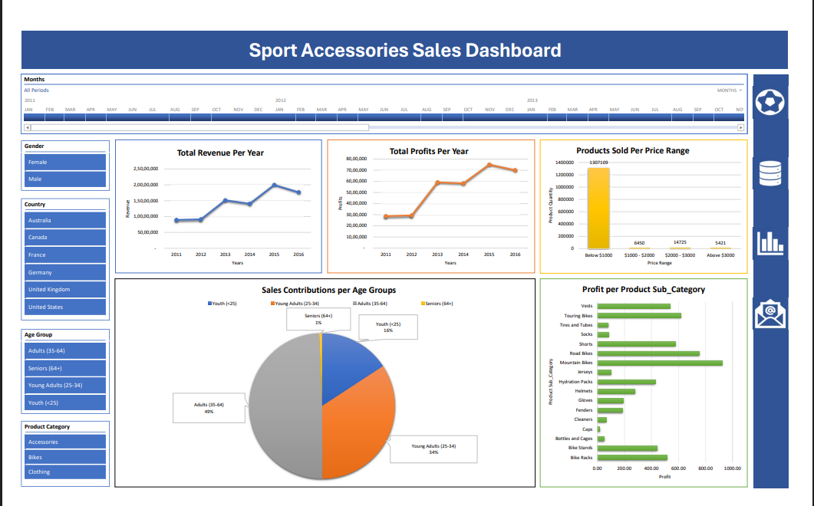

# 🏀 Sports Accessories Sales Analysis

This project is a basic sales analysis of a sports accessories dataset using Microsoft Excel. It focuses on key performance metrics and visualizations to understand sales trends, top-performing products, and customer behavior.

## 📁 Files Included

- `Sales_Workbook.xlsx`: Main dataset used for analysis
- `Dashboard_Image.png`: Image of the final Excel dashboard

## 🎯 Project Goals

- Analyze overall sales performance
- Identify top products and customers
- Explore sales by region and time period
- Create a clear and interactive Excel dashboard

## 🛠 Tools Used

- Microsoft Excel
  - PivotTables
  - Charts
  - Slicers
  - Basic formulas

## 📈 Key Metrics Analyzed

- Total Revenue
- Product sold per categoary, sub-category
- Total Profit 
- Year-on-Year Trends

## 📊 Dashboard Preview

## 🔍 Summary

This Excel project gives a quick overview of how sports accessories are performing in terms of sales and profitability. It is useful for identifying sales opportunities and making data-driven business decisions.
